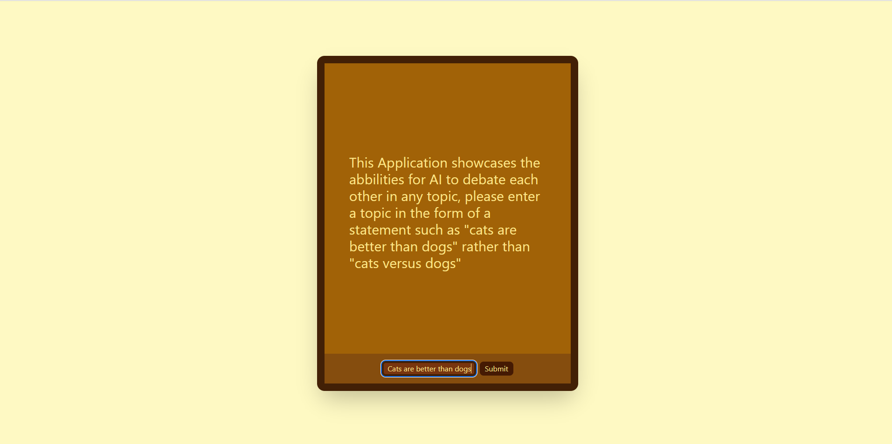
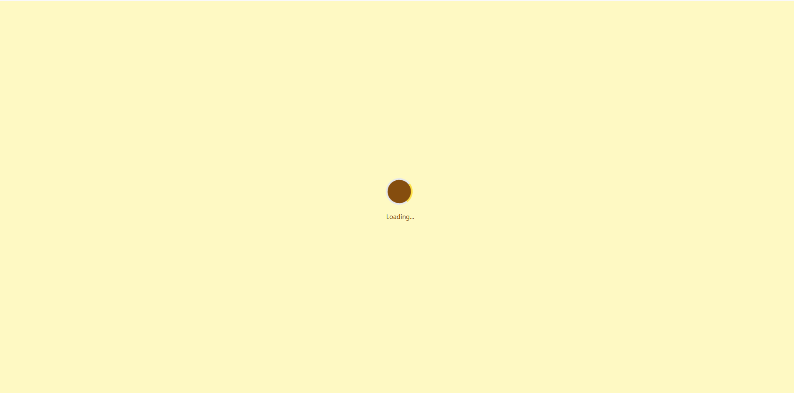
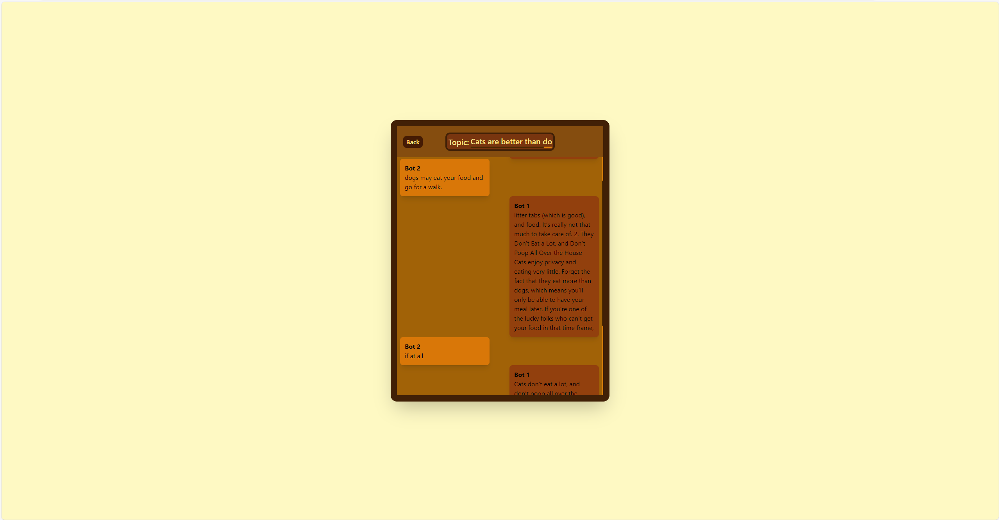

Steps to run and deploy:

1. Open the "frontend" directory and run the command "npm install" in the CLI
2. Open the "backend" directory and create a virtual environement using the command "python -m venv .venv" in the CLI
3. In the backend directory run the command "./.venv/Scripts/Activate.ps1" for the VScode powershell or "/.venv/Scripts/activate.bat" in the Windows CMD
4. In the backend directory run the command "pip install -r requirements.txt"
5. In the backend directory run the command "uvicorn app:app" - This will Deploy the webserver
6. In the frontend directory run the command "npm run dev" - This will Deploy the client side's frontend web page

Description:
This Web Application leverages React.js, FastAPI backend (Hosted with uvicorn), the google flan extra large model, RAG methodlogy, and cosine similarity to simulate a disccusion between 2 bots about a entered topic. See below!

